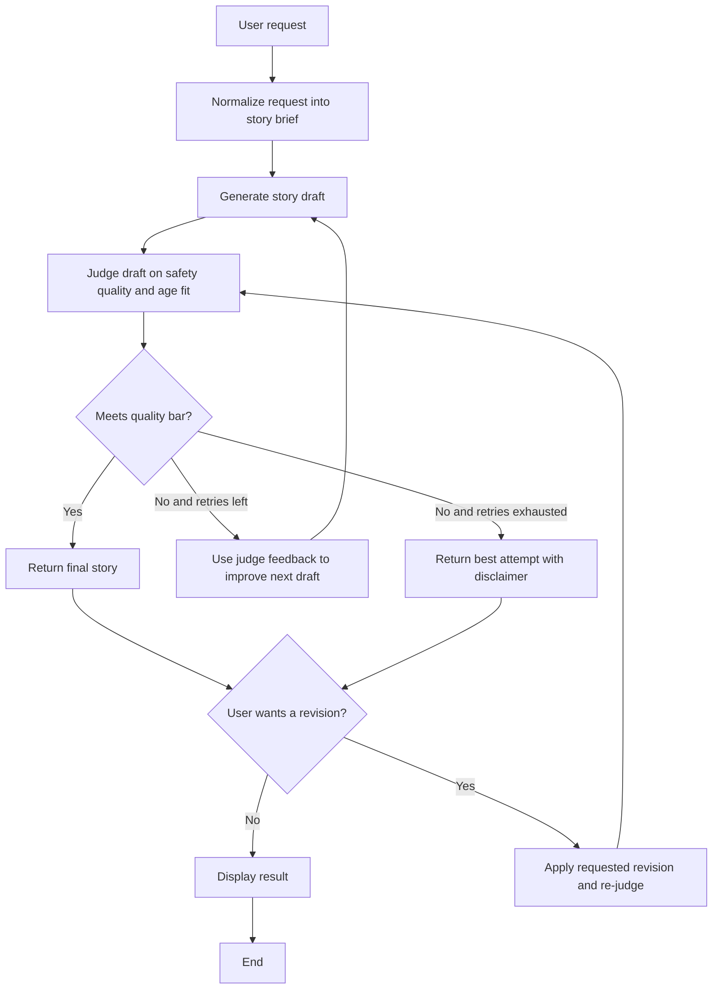

# Bedtime Stories 📚✨

This project generates bedtime stories for ages 5-10 using a storyteller + judge loop.
It keeps the required model (`gpt-3.5-turbo`) and improves output quality with bounded retries and rubric-based feedback.

## What This System Does 🌙

1. Takes a free-text story request from the user.
2. Normalizes it into a `StoryBrief` (bedtime goal, age band, target length).
3. Generates a story draft with strict safety and bedtime constraints.
4. Judges the draft on 5 rubric dimensions:
   - `safety`
   - `age_fit`
   - `coherence`
   - `engagement`
   - `language_simplicity`
5. Retries up to 3 total attempts using judge feedback if thresholds are not met.
6. Returns the best draft (with disclaimer if needed).
7. Supports one optional user revision, then re-runs judge evaluation.

## System Block Diagram 🧭



See [docs/system_block_diagram.md](docs/system_block_diagram.md) for a more in-depth view.

## Prompt Flow Summary 🔁

- `normalize_user_request` prompt: extracts a concise bedtime goal.
- `generate_story_draft` prompt: enforces safety policy, age fit, calming tone, and target length.
- `evaluate_story_draft` prompt: scores the story (1-5) and returns parseable feedback.
- Retry loop: failing dimensions (<4) become feedback for the next storyteller prompt.
- Revision prompt: applies user change request while preserving safety constraints.

## Repository Structure 🗂️

| Path | Purpose |
| --- | --- |
| `story_generator.py` | Primary CLI entry point. |
| `main.py` | Shared `call_model()` OpenAI client wrapper. |
| `storyteller.py` | Request normalization and story draft generation. |
| `judge.py` | Rubric evaluation and parser logic. |
| `orchestrator.py` | Retry loop, threshold checks, and revision flow. |
| `models.py` | Dataclasses (`StoryBrief`, `StoryDraft`, `RubricScore`, `GenerationResult`). |
| `tests/` | Unit and property-style tests. |

## Setup and Run (venv + install + execute) 🛠️

### 1. Create and activate virtual environment

```bash
python3 -m venv .venv
source .venv/bin/activate
```

### 2. Install dependencies

```bash
pip install -r requirements.txt
```

### 3. Configure environment variables

Create `.env` in the project root:

```bash
OPENAI_API_KEY=your_api_key_here
```

### 4. Run the project

```bash
python story_generator.py
```

You can also run the simpler baseline CLI with:

```bash
python main.py
```

## Optional: Run Tests ✅

```bash
pytest -q
```
