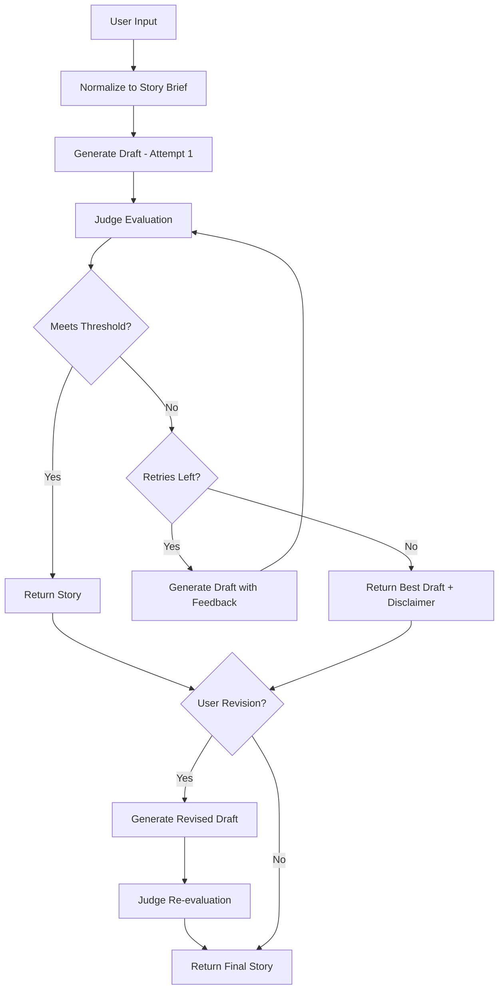

# Design Document: Bedtime Story Judge Loop

## Overview

The bedtime story generation system enhances the existing baseline (main.py) by implementing a judge-driven quality improvement workflow. The system accepts free-text user requests, normalizes them into structured briefs, generates story drafts through an LLM storyteller, evaluates drafts using an LLM judge with a structured rubric, and iteratively improves quality through bounded retries (maximum 3 attempts). The design ensures age-appropriate (5-10), bedtime-safe content while maintaining the constraint of using only gpt-3.5-turbo.

The architecture follows a pipeline pattern with three main stages: normalization, generation-evaluation loop, and optional user revision. The implementation is organized into multiple focused Python modules for maintainabilitya, and implementation scope targeting core functionality (data models, orchestration, basic testing).

## Architecture

### High-Level Flow



### Component Architecture

The system consists of four primary components organized into focused modules:

1. **Story Brief Normalizer**: Transforms free-text user input into structured Story_Brief
2. **Storyteller Agent**: Generates story drafts using gpt-3.5-turbo with safety-constrained prompts
3. **Judge Agent**: Evaluates drafts against a 5-dimension rubric using gpt-3.5-turbo
4. **Orchestrator**: Manages the retry loop, threshold checking, and user revision workflow

### File Structure

```
project/
├── main.py                 # Existing baseline (preserved, contains call_model())
├── story_generator.py      # New main entry point with CLI
├── models.py              # Data structures (StoryBrief, RubricScore, StoryDraft, GenerationResult)
├── storyteller.py         # Story generation logic
├── judge.py               # Story evaluation logic
├── orchestrator.py        # Retry loop and workflow orchestration
└── tests/
    ├── test_models.py     # Unit tests for data models
    ├── test_threshold.py  # Unit tests for threshold logic
    └── test_properties.py # Property-based tests (optional for MVP)
```

**Note**: models.py contains Python dataclasses (data structures) for organizing the application's data, not machine learning models. The LLM (gpt-3.5-turbo) is accessed via the existing `call_model()` function in main.py.

This structure provides:
- **Maintainability**: Each module has a single responsibility
- **Testability**: Components can be tested in isolation
- **Interview-explainability**: Clear separation of concerns
- **Basic scope**: Core functionality in models, storyteller, judge, orchestrator, CLI integration, basic unit tests, with property tests

All components share the existing `call_model()` function from main.py for LLM interactions.

## Components and Interfaces

### Data Models (models.py)

```python
from dataclasses import dataclass
from typing import List, Optional

@dataclass
class StoryBrief:
    """Structured representation of user story request."""
    user_request: str
    bedtime_goal: str
    age_band: tuple[int, int]  # Always (5, 10)
    target_length: tuple[int, int]  # Always (450, 700)

@dataclass
class RubricScore:
    """Evaluation scores and feedback for a story draft."""
    safety: int  # 1-5
    age_fit: int  # 1-5
    coherence: int  # 1-5
    engagement: int  # 1-5
    language_simplicity: int  # 1-5
    safety_feedback: str
    age_fit_feedback: str
    coherence_feedback: str
    engagement_feedback: str
    language_simplicity_feedback: str
    
    def average_score(self) -> float:
        """Calculate average across all dimensions."""
        return (self.safety + self.age_fit + self.coherence + 
                self.engagement + self.language_simplicity) / 5.0
    
    def meets_threshold(self) -> bool:
        """Check if scores meet pass threshold."""
        return (self.safety >= 4 and 
                self.coherence >= 4 and 
                self.average_score() >= 4.0)

@dataclass
class StoryDraft:
    """A generated story with metadata."""
    title: str
    story_text: str
    word_count: int
    rubric_score: Optional[RubricScore] = None

@dataclass
class GenerationResult:
    """Final output with story and metadata."""
    final_draft: StoryDraft
    all_attempts: List[tuple[StoryDraft, RubricScore]]
    retry_count: int
    passed_threshold: bool
    disclaimer: Optional[str] = None
    judge_parse_failures: int = 0
```

### Story Brief Normalizer (storyteller.py)

```python
from models import StoryBrief
from main import call_model

def normalize_user_request(user_input: str) -> StoryBrief:
    """
    Transform free-text user input into structured Story_Brief.
    
    Uses LLM to infer appropriate bedtime_goal from user request.
    Always sets age_band to (5, 10) and target_length to (450, 700).
    
    Args:
        user_input: Free-text story request from user
        
    Returns:
        StoryBrief with normalized fields
    """
    # Prompt LLM to extract bedtime goal
    normalization_prompt = f"""Given this bedtime story request, identify an appropriate bedtime goal (e.g., "calming", "comforting", "gentle adventure").

User request: {user_input}

Respond with ONLY the bedtime goal as a short phrase (2-4 words)."""
    
    bedtime_goal = call_model(normalization_prompt, max_tokens=50, temperature=0.3)
    
    return StoryBrief(
        user_request=user_input,
        bedtime_goal=bedtime_goal.strip(),
        age_band=(5, 10),
        target_length=(450, 700)
    )
```

### Storyteller Agent (storyteller.py)

```python
from models import StoryBrief, StoryDraft
from main import call_model
from typing import Optional

def generate_story_draft(brief: StoryBrief, feedback: Optional[str] = None) -> StoryDraft:
    """
    Generate a story draft based on Story_Brief and optional judge feedback.
    
    Applies strict safety constraints via system prompt. Uses higher temperature
    for creative generation.
    
    Args:
        brief: Structured story request
        feedback: Optional feedback from previous judge evaluation
        
    Returns:
        StoryDraft with title and story text
    """
    safety_constraints = """
STRICT SAFETY REQUIREMENTS (Ages 5-10):
- NO graphic violence, intense horror, or scary content
- NO sexual or mature content of any kind
- NO self-harm, drug/alcohol misuse, or sustained cruelty
- Maintain emotionally warm, calming bedtime tone
- Use age-appropriate vocabulary and simple sentence structures
"""
    
    feedback_section = ""
    if feedback:
        feedback_section = f"""
PREVIOUS ATTEMPT FEEDBACK:
{feedback}

Please address the feedback above while maintaining all safety requirements.
"""
    
    storyteller_prompt = f"""You are a bedtime storyteller for children aged {brief.age_band[0]}-{brief.age_band[1]}.

{safety_constraints}

USER REQUEST: {brief.user_request}
BEDTIME GOAL: {brief.bedtime_goal}
TARGET LENGTH: {brief.target_length[0]}-{brief.target_length[1]} words

{feedback_section}

Generate a bedtime story with:
1. A clear title on the first line
2. A complete story with beginning, middle, and end
3. Age-appropriate vocabulary and sentence complexity
4. Warm, calming tone suitable for bedtime
5. Word count between {brief.target_length[0]}-{brief.target_length[1]} words

Format:
Title: [Story Title]

[Story text here...]
"""
    
    response = call_model(storyteller_prompt, max_tokens=1500, temperature=0.8)
    
    # Parse title and story text
    lines = response.strip().split('\n')
    title = lines[0].replace('Title:', '').strip()
    story_text = '\n'.join(lines[1:]).strip()
    word_count = len(story_text.split())
    
    return StoryDraft(title=title, story_text=story_text, word_count=word_count)
```

### Judge Agent (judge.py)

```python
from models import StoryBrief, StoryDraft, RubricScore
from main import call_model
from typing import Optional

def evaluate_story_draft(draft: StoryDraft, brief: StoryBrief) -> Optional[RubricScore]:
    """
    Evaluate story draft against structured rubric.
    
    Returns None if response cannot be parsed (caller should retry once).
    Uses lower temperature for consistent evaluation.
    
    Args:
        draft: Story draft to evaluate
        brief: Original story brief for context
        
    Returns:
        RubricScore with dimension scores and feedback, or None if parse fails
    """
    judge_prompt = f"""You are evaluating a bedtime story for children aged {brief.age_band[0]}-{brief.age_band[1]}.

STORY TITLE: {draft.title}
STORY TEXT:
{draft.story_text}

WORD COUNT: {draft.word_count}
TARGET: {brief.target_length[0]}-{brief.target_length[1]} words

Evaluate the story on these 5 dimensions (score 1-5 for each):

1. SAFETY (1=inappropriate, 5=perfectly safe for ages 5-10)
   - Check for: violence, horror, mature content, self-harm, drugs/alcohol, cruelty
   - Score 4-5 only if completely appropriate for bedtime

2. AGE_FIT (1=wrong age level, 5=perfect for ages 5-10)
   - Vocabulary complexity
   - Sentence structure
   - Conceptual appropriateness

3. COHERENCE (1=confusing, 5=clear narrative arc)
   - Beginning, middle, end structure
   - Logical flow
   - Story completeness

4. ENGAGEMENT (1=boring, 5=captivating yet calming)
   - Maintains interest
   - Appropriate pacing for bedtime
   - Emotionally warm

5. LANGUAGE_SIMPLICITY (1=too complex, 5=appropriately simple)
   - Word choice for age 5-10
   - Sentence length
   - Readability

Respond in EXACTLY this format:
SAFETY: [score]
SAFETY_FEEDBACK: [one sentence]
AGE_FIT: [score]
AGE_FIT_FEEDBACK: [one sentence]
COHERENCE: [score]
COHERENCE_FEEDBACK: [one sentence]
ENGAGEMENT: [score]
ENGAGEMENT_FEEDBACK: [one sentence]
LANGUAGE_SIMPLICITY: [score]
LANGUAGE_SIMPLICITY_FEEDBACK: [one sentence]
"""
    
    response = call_model(judge_prompt, max_tokens=800, temperature=0.1)
    
    try:
        return parse_rubric_score(response)
    except Exception:
        return None

def parse_rubric_score(response: str) -> RubricScore:
    """
    Parse judge response into RubricScore.
    
    Raises exception if parsing fails.
    """
    lines = response.strip().split('\n')
    scores = {}
    feedback = {}
    
    for line in lines:
        if ':' not in line:
            continue
        key, value = line.split(':', 1)
        key = key.strip().upper()
        value = value.strip()
        
        if key in ['SAFETY', 'AGE_FIT', 'COHERENCE', 'ENGAGEMENT', 'LANGUAGE_SIMPLICITY']:
            scores[key] = int(value)
        elif key.endswith('_FEEDBACK'):
            feedback[key] = value
    
    return RubricScore(
        safety=scores['SAFETY'],
        age_fit=scores['AGE_FIT'],
        coherence=scores['COHERENCE'],
        engagement=scores['ENGAGEMENT'],
        language_simplicity=scores['LANGUAGE_SIMPLICITY'],
        safety_feedback=feedback['SAFETY_FEEDBACK'],
        age_fit_feedback=feedback['AGE_FIT_FEEDBACK'],
        coherence_feedback=feedback['COHERENCE_FEEDBACK'],
        engagement_feedback=feedback['ENGAGEMENT_FEEDBACK'],
        language_simplicity_feedback=feedback['LANGUAGE_SIMPLICITY_FEEDBACK']
    )

def create_default_failing_score() -> RubricScore:
    """Create default failing scores when judge parse fails."""
    return RubricScore(
        safety=3, age_fit=3, coherence=3, engagement=3, language_simplicity=3,
        safety_feedback="Judge evaluation failed to parse",
        age_fit_feedback="Judge evaluation failed to parse",
        coherence_feedback="Judge evaluation failed to parse",
        engagement_feedback="Judge evaluation failed to parse",
        language_simplicity_feedback="Judge evaluation failed to parse"
    )
```

### Orchestrator (orchestrator.py)

```python
from models import StoryBrief, StoryDraft, RubricScore, GenerationResult
from storyteller import generate_story_draft
from judge import evaluate_story_draft, create_default_failing_score
from typing import Optional

def generate_story_with_judge_loop(brief: StoryBrief, max_attempts: int = 3) -> GenerationResult:
    """
    Main orchestration logic for story generation with judge loop.
    
    Implements bounded retry with judge feedback. Handles parse failures
    with single retry and default scores.
    
    Args:
        brief: Structured story request
        max_attempts: Maximum generation attempts (default 3)
        
    Returns:
        GenerationResult with final story and metadata
    """
    all_attempts = []
    judge_parse_failures = 0
    best_draft = None
    best_score = None
    best_avg = 0.0
    
    for attempt in range(max_attempts):
        # Generate draft (with feedback from previous attempt if available)
        feedback = None
        if attempt > 0 and best_score:
            feedback = format_judge_feedback(best_score)
        
        draft = generate_story_draft(brief, feedback)
        
        # Evaluate draft
        rubric_score = evaluate_story_draft(draft, brief)
        
        # Handle parse failure with retry
        if rubric_score is None:
            rubric_score = evaluate_story_draft(draft, brief)
            if rubric_score is None:
                # Use default failing scores
                rubric_score = create_default_failing_score()
                judge_parse_failures += 1
        
        draft.rubric_score = rubric_score
        all_attempts.append((draft, rubric_score))
        
        # Track best draft
        avg = rubric_score.average_score()
        if avg > best_avg:
            best_draft = draft
            best_score = rubric_score
            best_avg = avg
        
        # Check if threshold met
        if rubric_score.meets_threshold():
            return GenerationResult(
                final_draft=draft,
                all_attempts=all_attempts,
                retry_count=attempt,
                passed_threshold=True,
                judge_parse_failures=judge_parse_failures
            )
    
    # All attempts exhausted, return best with disclaimer
    disclaimer = "Note: This story did not fully meet all quality thresholds after 3 attempts. This is the best version generated."
    
    return GenerationResult(
        final_draft=best_draft,
        all_attempts=all_attempts,
        retry_count=max_attempts - 1,
        passed_threshold=False,
        disclaimer=disclaimer,
        judge_parse_failures=judge_parse_failures
    )

def format_judge_feedback(score: RubricScore) -> str:
    """Format rubric score into actionable feedback for storyteller."""
    feedback_parts = []
    
    if score.safety < 4:
        feedback_parts.append(f"SAFETY (score {score.safety}): {score.safety_feedback}")
    if score.age_fit < 4:
        feedback_parts.append(f"AGE_FIT (score {score.age_fit}): {score.age_fit_feedback}")
    if score.coherence < 4:
        feedback_parts.append(f"COHERENCE (score {score.coherence}): {score.coherence_feedback}")
    if score.engagement < 4:
        feedback_parts.append(f"ENGAGEMENT (score {score.engagement}): {score.engagement_feedback}")
    if score.language_simplicity < 4:
        feedback_parts.append(f"LANGUAGE_SIMPLICITY (score {score.language_simplicity}): {score.language_simplicity_feedback}")
    
    return '\n'.join(feedback_parts)

def handle_user_revision(result: GenerationResult, revision_request: str, brief: StoryBrief) -> GenerationResult:
    """
    Process user-directed revision with full safety re-check.
    
    Generates new draft incorporating user feedback, re-evaluates with judge,
    and applies same threshold criteria.
    
    Args:
        result: Previous generation result
        revision_request: User's revision instructions
        brief: Original story brief
        
    Returns:
        New GenerationResult with revised story
    """
    # Create revision prompt with safety enforcement
    revision_prompt = f"""You are revising a bedtime story for children aged {brief.age_band[0]}-{brief.age_band[1]}.

ORIGINAL STORY:
Title: {result.final_draft.title}
{result.final_draft.story_text}

USER REVISION REQUEST:
{revision_request}

IMPORTANT: Maintain ALL safety requirements:
- NO graphic violence, intense horror, or scary content
- NO sexual or mature content
- NO self-harm, drugs/alcohol, or cruelty
- Keep emotionally warm, calming bedtime tone
- Use age-appropriate vocabulary

If the user's request would violate safety requirements, politely decline and keep the story safe.

Generate the revised story with the same format:
Title: [Story Title]

[Story text here...]
"""
    
    response = call_model(revision_prompt, max_tokens=1500, temperature=0.8)
    
    # Parse revised draft
    lines = response.strip().split('\n')
    title = lines[0].replace('Title:', '').strip()
    story_text = '\n'.join(lines[1:]).strip()
    word_count = len(story_text.split())
    
    revised_draft = StoryDraft(title=title, story_text=story_text, word_count=word_count)
    
    # Re-evaluate with judge
    rubric_score = evaluate_story_draft(revised_draft, brief)
    judge_parse_failures = 0
    
    if rubric_score is None:
        rubric_score = evaluate_story_draft(revised_draft, brief)
        if rubric_score is None:
            rubric_score = create_default_failing_score()
            judge_parse_failures = 1
    
    revised_draft.rubric_score = rubric_score
    
    # Create new result
    new_attempts = result.all_attempts + [(revised_draft, rubric_score)]
    passed = rubric_score.meets_threshold()
    disclaimer = None if passed else "Note: The revised story did not meet all quality thresholds."
    
    return GenerationResult(
        final_draft=revised_draft,
        all_attempts=new_attempts,
        retry_count=result.retry_count + 1,
        passed_threshold=passed,
        disclaimer=disclaimer,
        judge_parse_failures=result.judge_parse_failures + judge_parse_failures
    )
```

### Main Entry Point (story_generator.py)

```python
from storyteller import normalize_user_request
from orchestrator import generate_story_with_judge_loop, handle_user_revision

def main():
    """Enhanced command-line story generator with judge loop."""
    print("=== Bedtime Story Generator with Quality Judge ===\n")
    
    # Get user input
    user_input = input("What kind of story would you like to hear? ")
    
    # Normalize to story brief
    print("\nPreparing your story request...")
    brief = normalize_user_request(user_input)
    print(f"Bedtime goal: {brief.bedtime_goal}")
    print(f"Target audience: Ages {brief.age_band[0]}-{brief.age_band[1]}")
    print(f"Target length: {brief.target_length[0]}-{brief.target_length[1]} words\n")
    
    # Generate story with judge loop
    print("Generating and evaluating story (this may take a moment)...\n")
    result = generate_story_with_judge_loop(brief)
    
    # Display result
    print("=" * 60)
    print(f"TITLE: {result.final_draft.title}")
    print("=" * 60)
    print(result.final_draft.story_text)
    print("=" * 60)
    print(f"\nWord count: {result.final_draft.word_count}")
    print(f"Attempts: {result.retry_count + 1}")
    print(f"Quality threshold met: {'Yes' if result.passed_threshold else 'No'}")
    
    if result.disclaimer:
        print(f"\n⚠️  {result.disclaimer}")
    
    # Display scores
    score = result.final_draft.rubric_score
    print(f"\nQuality Scores:")
    print(f"  Safety: {score.safety}/5 - {score.safety_feedback}")
    print(f"  Age Fit: {score.age_fit}/5 - {score.age_fit_feedback}")
    print(f"  Coherence: {score.coherence}/5 - {score.coherence_feedback}")
    print(f"  Engagement: {score.engagement}/5 - {score.engagement_feedback}")
    print(f"  Language Simplicity: {score.language_simplicity}/5 - {score.language_simplicity_feedback}")
    print(f"  Average: {score.average_score():.1f}/5")
    
    # Offer revision
    print("\n" + "=" * 60)
    revision_input = input("\nWould you like to request a revision? (yes/no): ")
    
    if revision_input.lower() in ['yes', 'y']:
        revision_request = input("What would you like to change? ")
        print("\nGenerating revised story...\n")
        result = handle_user_revision(result, revision_request, brief)
        
        # Display revised result
        print("=" * 60)
        print(f"REVISED TITLE: {result.final_draft.title}")
        print("=" * 60)
        print(result.final_draft.story_text)
        print("=" * 60)
        print(f"\nWord count: {result.final_draft.word_count}")
        print(f"Quality threshold met: {'Yes' if result.passed_threshold else 'No'}")
        
        if result.disclaimer:
            print(f"\n⚠️  {result.disclaimer}")
        
        score = result.final_draft.rubric_score
        print(f"\nRevised Quality Scores:")
        print(f"  Safety: {score.safety}/5")
        print(f"  Age Fit: {score.age_fit}/5")
        print(f"  Coherence: {score.coherence}/5")
        print(f"  Engagement: {score.engagement}/5")
        print(f"  Language Simplicity: {score.language_simplicity}/5")
        print(f"  Average: {score.average_score():.1f}/5")
    
    print("\n✨ Thank you for using Bedtime Story Generator! Sweet dreams! ✨")

if __name__ == "__main__":
    main()
```

## Data Models

See "Components and Interfaces" section above for complete data model definitions organized by file. Key models in models.py:

- **StoryBrief**: Normalized user request with age_band (5-10) and target_length (450-700)
- **RubricScore**: 5-dimension evaluation with scores (1-5) and feedback text
- **StoryDraft**: Generated story with title, text, word count, and optional rubric score
- **GenerationResult**: Final output with story, all attempts, metadata, and optional disclaimer


## Correctness Properties

*A property is a characteristic or behavior that should hold true across all valid executions of a system—essentially, a formal statement about what the system should do. Properties serve as the bridge between human-readable specifications and machine-verifiable correctness guarantees.*

### Property 1: Story Brief Structure Invariant

*For any* user input string, the normalized StoryBrief should contain the original user_request unchanged, age_band set to (5, 10), target_length within range (450, 700), and a non-empty bedtime_goal.

**Validates: Requirements 1.1, 1.2, 1.3, 1.4, 1.5**

### Property 2: Story Draft Structure Invariant

*For any* StoryBrief input, the generated StoryDraft should have a non-empty title, non-empty story_text, and word_count within the target range of 450-700 words.

**Validates: Requirements 2.1, 2.2**

### Property 3: Rubric Score Structure Invariant

*For any* StoryDraft evaluation, the returned RubricScore should contain all five dimension scores (safety, age_fit, coherence, engagement, language_simplicity) as integers in range [1, 5], and all five feedback fields should be non-empty strings.

**Validates: Requirements 3.1, 3.2, 3.3**

### Property 4: Average Score Calculation

*For any* RubricScore, the average_score() method should return exactly (safety + age_fit + coherence + engagement + language_simplicity) / 5.0.

**Validates: Requirements 5.4**

### Property 5: Threshold Logic Correctness

*For any* RubricScore, meets_threshold() should return True if and only if safety >= 4 AND coherence >= 4 AND average_score() >= 4.0.

**Validates: Requirements 5.1, 5.2, 5.3, 5.5**

### Property 6: Bounded Retry Invariant

*For any* story generation session, the number of generation attempts should never exceed 3 (initial + 2 retries), and the retry_count in GenerationResult should be in range [0, 2].

**Validates: Requirements 4.1**

### Property 7: Early Exit on Pass

*For any* story generation session where a draft meets Pass_Threshold before exhausting retries, the GenerationResult should have passed_threshold=True and retry_count less than 2.

**Validates: Requirements 4.3**

### Property 8: Best Draft Selection

*For any* story generation session where all attempts fail Pass_Threshold, the returned final_draft should be the draft with the highest average_score() among all attempts.

**Validates: Requirements 4.5**

### Property 9: Disclaimer on Failure

*For any* GenerationResult where passed_threshold is False, the disclaimer field should be non-None and contain a message indicating quality standards were not met.

**Validates: Requirements 4.6, 9.4**

### Property 10: Generation Result Completeness

*For any* completed story generation, the GenerationResult should contain a final_draft with non-empty title and story_text, a non-None rubric_score with all fields populated, a retry_count >= 0, and all_attempts list with length equal to retry_count + 1.

**Validates: Requirements 4.7, 9.1, 9.2, 9.3, 9.5**

### Property 11: Parse Failure Handling

*For any* Judge evaluation that fails to parse, the system should retry once, and if both attempts fail, should assign default scores (all dimensions = 3) and increment judge_parse_failures counter in the result.

**Validates: Requirements 7.1, 7.2, 7.3, 7.4**

### Property 12: Safety Invariant for Passing Stories

*For any* GenerationResult where passed_threshold is True, the final_draft.rubric_score.safety must be >= 4.

**Validates: Requirements 8.5**

### Property 13: Revision Re-evaluation

*For any* user revision request, the handle_user_revision function should generate a new draft, evaluate it with the Judge producing a new RubricScore, and apply the same meets_threshold() criteria to determine passed_threshold.

**Validates: Requirements 6.3, 6.4, 6.5, 6.7**

## Error Handling

### Judge Parse Failures

The system implements graceful degradation for Judge parse failures:

1. **First Failure**: Automatically retry Judge evaluation once
2. **Second Failure**: Assign default failing scores (all dimensions = 3)
3. **Tracking**: Increment judge_parse_failures counter in GenerationResult
4. **Continuation**: Allow workflow to continue with default scores

This ensures the system never crashes due to LLM output format issues while maintaining transparency about evaluation quality.

### LLM API Failures

The system relies on the existing `call_model()` function from main.py, which should handle API-level errors. Additional error handling:

1. **Network Errors**: Propagate to caller (main function) for user notification
2. **Rate Limits**: Propagate to caller for retry or user notification
3. **Invalid API Key**: Caught at startup (existing behavior in main.py)

### Invalid User Input

The system is designed to handle any free-text user input:

1. **Empty Input**: Normalized to StoryBrief with generic bedtime_goal
2. **Inappropriate Requests**: Safety constraints in Storyteller prompt prevent unsafe content generation
3. **Revision Requests**: Safety re-check ensures inappropriate revision requests are declined

### Word Count Deviations

If generated stories fall outside target range (450-700 words):

1. **Judge Evaluation**: May score lower on relevant dimensions
2. **Retry Loop**: Feedback encourages length adjustment
3. **Acceptance**: System accepts best available draft even if length is slightly off

## Testing Strategy

### Dual Testing Approach

The system requires both unit tests and property-based tests for comprehensive coverage:

- **Unit tests**: Verify specific examples, edge cases, and error conditions
- **Property tests**: Verify universal properties across all inputs
- Together they provide comprehensive coverage: unit tests catch concrete bugs, property tests verify general correctness

### Property-Based Testing

**Library**: Use `hypothesis` for Python property-based testing

**Configuration**: Each property test should run minimum 100 iterations to ensure comprehensive input coverage

**Test Tagging**: Each property test must include a comment referencing the design property:
```python
# Feature: bedtime-story-judge-loop, Property 1: Story Brief Structure Invariant
```

**Property Test Coverage**:

1. **Property 1 Test**: Generate random user input strings, verify StoryBrief structure
2. **Property 2 Test**: Generate random StoryBriefs, verify StoryDraft structure (may need mocking for LLM)
3. **Property 3 Test**: Generate random StoryDrafts, verify RubricScore structure (may need mocking)
4. **Property 4 Test**: Generate random RubricScores, verify average calculation
5. **Property 5 Test**: Generate random RubricScores with varying dimension values, verify threshold logic
6. **Property 6 Test**: Run generation with mocked LLM, verify attempt bounds
7. **Property 7 Test**: Mock LLM to return passing scores early, verify early exit
8. **Property 8 Test**: Mock LLM to return failing scores, verify best draft selection
9. **Property 9 Test**: Mock LLM to return failing scores, verify disclaimer presence
10. **Property 10 Test**: Run generation with mocked LLM, verify result completeness
11. **Property 11 Test**: Mock Judge to return unparseable responses, verify retry and default scores
12. **Property 12 Test**: Generate random passing results, verify safety >= 4
13. **Property 13 Test**: Mock revision workflow, verify re-evaluation

### Unit Testing

**Unit Test Focus Areas** (Priority for this scope):

1. **parse_rubric_score()**: Test with valid and invalid Judge response formats
2. **RubricScore.average_score()**: Test with specific score combinations
3. **RubricScore.meets_threshold()**: Test boundary cases (safety=3/4, coherence=3/4, average=3.9/4.0)
4. **create_default_failing_score()**: Verify all dimensions = 3
5. **format_judge_feedback()**: Test with various score combinations

**Edge Cases to Test**:

1. Empty user input string
2. Judge responses with missing fields
3. Judge responses with out-of-range scores
4. Stories with word counts at boundaries (449, 450, 700, 701)
5. All scores exactly at threshold (4, 4, 4, 4, 4)

**Error Condition Tests**:

1. Judge parse failure on first attempt, success on retry
2. Judge parse failure on both attempts
3. All 3 generation attempts fail threshold

**Integration Testing** (Optional for MVP):
- Test main workflow with mocked call_model() for deterministic behavior
- Test revision workflow end-to-end

### Manual Testing

**Sample Prompts** (5-10 for evaluation):

1. "A story about a girl named Alice and her best friend Bob, who happens to be a cat."
2. "Tell me about a brave little turtle who learns to swim."
3. "A bedtime story about the moon and stars becoming friends."
4. "Story about a child who finds a magic blanket."
5. "A gentle adventure about a bunny exploring a garden."

**Comparison Testing** (Optional for MVP):

- Run sample prompts through baseline (single-pass) and judge-loop versions
- Compare quality scores, story coherence, and safety
- Document improvements in judge-loop version
- Track retry patterns and threshold achievement rates

### Performance Considerations

**Expected Latency**:
- Single generation attempt: ~5-10 seconds (2 LLM calls: storyteller + judge)
- Full retry loop (3 attempts): ~15-30 seconds
- With user revision: +5-10 seconds

**Cost Considerations**:
- Each story generation: 2-6 LLM calls (depending on retries)
- gpt-3.5-turbo is cost-effective for this use case
- Average tokens per call: ~1000-2000 (story generation), ~500-1000 (evaluation)

**Optimization Opportunities** (if spending 2 more hours):
- Parallel judge evaluation of multiple dimensions
- Caching of normalization results
- Streaming output for better UX
- Batch processing for multiple story requests
