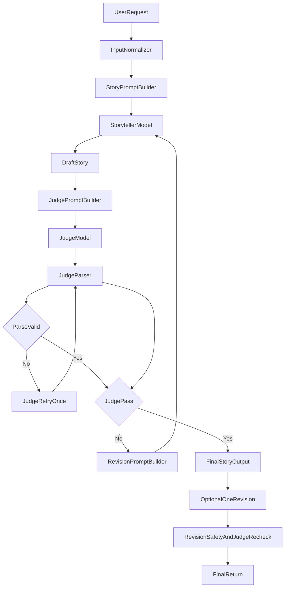

# Product Requirements Document (PRD): Bedtime Stories

## 1) Problem Statement

The current `main.py` accepts a user prompt and returns one unreviewed model response. This does not reliably guarantee age appropriateness (5-10), bedtime-safe content, or consistent narrative quality. The project needs a simple, explainable storytelling workflow that uses an LLM judge to improve quality before final output.

## 2) Assignment Requirement Mapping

| Assignment Requirement | PRD Response | Evaluation Signal |
| --- | --- | --- |
| Tell a bedtime story appropriate for ages 5-10 | Storyteller prompt enforces age band, bedtime tone, and safety boundaries | Judge `age_fit` and `safety` scores meet threshold |
| Incorporate an LLM judge | Dedicated judge evaluates every draft with structured rubric and revision instructions | Draft-to-draft score improvement across retries |
| Provide a block diagram | Mermaid flowchart included with user, storyteller, judge, and retry/fallback paths | Reviewer can trace control flow quickly |
| Keep current OpenAI model | Continue using `gpt-3.5-turbo` | No model change in implementation |
| Explainability and practical scope | Single-script-friendly loop, bounded retries, explicit contracts | Easy to explain in interview under time limit |

## 3) Product Strategy, Goals, and Non-Goals

### Product Strategy (Chosen)

- Optimize for a balanced MVP: good quality, reasonable latency/cost, and easy interview explanation.
- Default interaction is single-turn generation plus one optional targeted revision request.

### Goals

- Generate a complete bedtime story for ages 5-10 with a calming, emotionally warm tone.
- Enforce very strict child-safety constraints at generation and revision stages.
- Improve quality with a judge-driven retry loop (up to bounded attempts).
- Preserve explainability with explicit prompt contracts, simple control flow, and measurable gates.

### Non-Goals

- Building a web UI, multi-user app, or long-lived memory system.
- Using extra models, tool orchestration frameworks, or vector databases.
- Implementing enterprise-grade policy moderation beyond assignment scope.
- Optimizing for maximum creativity variance at the cost of consistency.

## 4) Baseline and MVP Gap

### Current Baseline (`main.py`)

- User input is passed to one model call.
- No strict output contract for story structure or length.
- No judge, no retries, no safety gating logic.

### MVP Gap to Close

- Add a normalized story brief with explicit `bedtime_goal`.
- Add storyteller prompt contract (age, tone, structure, length).
- Add judge contract (structured scoring and concrete revision actions).
- Add bounded retry loop with max-attempt fallback behavior.
- Add one optional post-output user revision turn with mandatory safety re-check.

## 5) Persona and Core Use Cases

### Primary Persona

- Parent/caregiver (or child with supervision) requesting a bedtime story.

### Core Use Cases

- User provides a request; system returns a medium-length (450-700 words) story with title.
- System self-checks quality and safety before returning the final draft.
- User requests one targeted change (for example, shorter ending or gentler tone).
- System applies allowed edits, re-runs safety and judge checks, then returns revised story.

## 6) MVP Functional Requirements

1. Accept free-text request from user.
2. Build a structured brief with:
   - Required: `user_request`, `bedtime_goal`
   - Defaults/fixed: `age_band=5-10`, `target_length=450-700`
   - Optional inferred fields: characters, setting/theme, tone details
3. Generate draft via storyteller prompt with constraints:
   - Child-safe and bedtime-calming
   - Clear beginning/middle/end arc
   - Age-appropriate vocabulary and sentence complexity
4. Judge each draft using structured rubric output.
5. If judge fails, revise using targeted judge instructions.
6. Retry up to max attempts (first draft + 2 retries).
7. Return best passing draft, or best available draft with concise quality disclaimer if retry cap is reached.
8. Offer one optional targeted revision turn.
9. Re-run full safety and judge checks for that revision before final return.

## 7) Prompt Flow and Contracts

### 7.1 Input Normalization Contract

- Required inputs:
  - `user_request`
  - `bedtime_goal` (for example: soothing sleep, confidence, kindness)
- Fixed defaults:
  - `age_band="5-10"`
  - `target_length="450-700 words"`
- Optional values (infer when absent):
  - `characters`
  - `setting_theme`
  - `tone_style`

### 7.2 Storyteller Prompt Contract

- Inputs:
  - normalized brief fields above
  - strict safety and bedtime tone constraints
  - structure instruction: title + beginning/middle/end
- Output:
  - title plus story text only
  - medium length target (450-700 words)

### 7.3 Judge Prompt Contract

- Inputs:
  - `story_text`
  - `age_band`
  - rubric definitions and thresholds
- Expected output schema:
  - `pass` (boolean)
  - `scores`: `safety`, `age_fit`, `coherence`, `engagement`, `language_simplicity` (1-5)
  - `critical_issues` (list)
  - `revision_instructions` (prioritized list of concrete fixes)

### 7.4 Revision Loop Contract

- On `pass=false`:
  - feed `original_request`, `previous_draft`, and `revision_instructions` into storyteller
- Stop when:
  - judge passes, or
  - max attempts reached
- On max attempts:
  - return best available draft with concise quality disclaimer
- Post-output optional revision:
  - allow one user-directed change request
  - always perform full safety + judge re-check before returning revised story

## 8) Safety and Content Policy

### Safety Level

- Very strict bedtime safety for ages 5-10.

### Always Block or Rewrite

- Graphic violence/injury
- Intense horror or fear-heavy scenarios
- Sexual or mature romantic content
- Self-harm or suicide themes
- Drug/alcohol misuse
- Sustained cruelty/bullying without repair

### Enforcement Points

- Storyteller prompt includes explicit safety prohibitions.
- Judge applies hard safety gate and surfaces critical issues.
- Optional user revision request is filtered by same safety policy.

## 9) Quality Rubric, Gates, and Output Format

### Judge Rubric (1-5 each)

- `safety`: no prohibited content categories.
- `age_fit`: concepts and language align with ages 5-10.
- `coherence`: clear arc, consistent details, complete ending.
- `engagement`: imaginative and emotionally warm pacing.
- `language_simplicity`: short-to-medium sentences, low jargon.

### Pass Thresholds (Selected)

- Hard gate: `safety >= 4` and no critical safety issue.
- Coherence gate: `coherence >= 4`.
- Overall gate: average score `>= 4.0`.

### Final Output Shape

- `Title`
- `Story`
- `Follow-up revision prompt` (for one optional targeted change)

## 10) Reliability and Failure Handling

- Judge parse failure handling:
  - retry judge once on malformed/unparseable output
  - if still malformed, use safe fallback evaluation path and continue predictably
- Retry cap behavior:
  - do not exceed first draft + 2 retries
  - return best draft with concise disclaimer if no pass
- Consistency preference:
  - balanced consistency and creativity, avoiding overly rigid or overly random outputs

## 11) Evaluation Plan (Interview-Proof Evidence)

### 11.1 Sample Prompt Suite

- Maintain a fixed set of 5-10 representative prompts, including:
  - simple animal friendship story
  - magical adventure with mild tension
  - personalized kindness/confidence bedtime goal
  - unusual user request requiring tone correction
  - revision-request scenario (change ending or shorten)

### 11.2 Per-Draft Score Tracking

- For each prompt, log per-attempt judge scores:
  - attempt index
  - pass/fail
  - rubric scores
  - key revision instructions applied
- Demonstrate that retries generally improve failed dimensions.

### 11.3 Baseline Comparison

- Compare:
  - baseline single-pass storyteller output
  - judge-loop final output
- Report qualitative and rubric-level deltas for safety, coherence, and age fit.

## 12) System Block Diagram

## 13) Risks and Mitigations

- Judge inconsistency: reduce ambiguity with explicit rubric language and concrete instruction format.
- Overlong stories: enforce length in storyteller prompt and penalize excess in judge instructions.
- Weak revision quality: require prioritized, actionable revision instructions.
- Latency/cost growth: cap retries and keep one optional user revision.
- Unsafe user edit requests: re-apply safety policy before and after revision.

## 15) Stretch Goal (Not Required for MVP)

- Add genre-aware prompt templates (for example: animal friendship, magic adventure, calm mystery) to increase engagement while preserving shared safety and rubric constraints.
