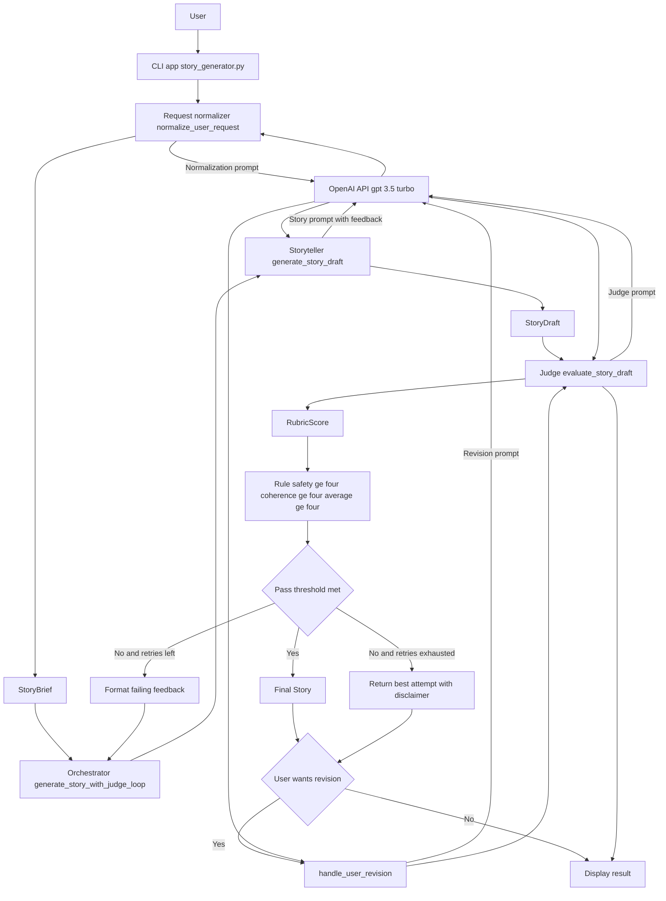

# System Block Diagram (In-Depth)

```mermaid
flowchart TD
    U[User] --> CLI[CLI app story_generator.py]
    CLI --> N[Request normalizer normalize_user_request]
    N -->|Normalization prompt| M[OpenAI API gpt 3.5 turbo]
    M --> N
    N --> B[StoryBrief]

    B --> O[Orchestrator generate_story_with_judge_loop]
    O --> S[Storyteller generate_story_draft]
    S -->|Story prompt with feedback| M
    M --> S
    S --> D[StoryDraft]

    D --> J[Judge evaluate_story_draft]
    J -->|Judge prompt| M
    M --> J
    J --> R[RubricScore]
    R --> P[Rule safety ge four coherence ge four average ge four]
    P --> T{Pass threshold met}
    T -->|Yes| F[Final Story]
    T -->|No and retries left| FB[Format failing feedback]
    FB --> O
    T -->|No and retries exhausted| BEST[Return best attempt with disclaimer]

    F --> REV{User wants revision}
    BEST --> REV
    REV -->|Yes| HR[handle_user_revision]
    HR -->|Revision prompt| M
    M --> HR
    HR --> J
    REV -->|No| OUT[Display result]
    J --> OUT
```
